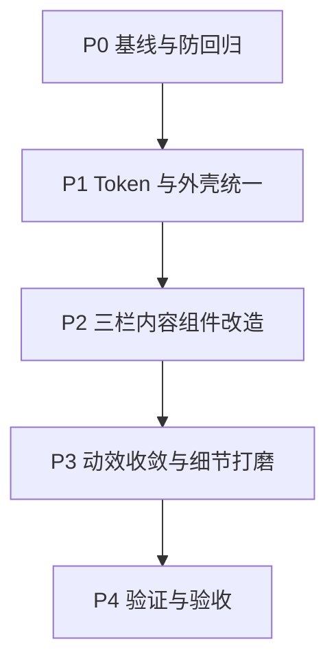
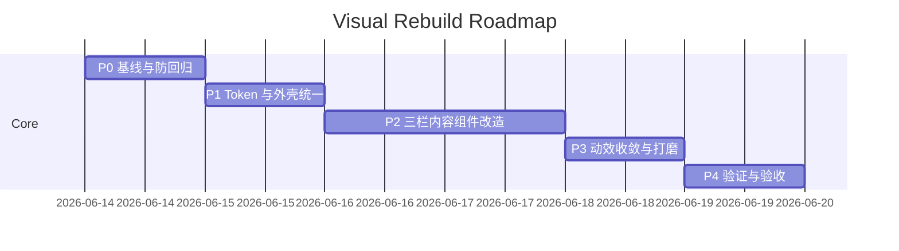

# Web Visual Rebuild Implementation Plan (Indigo Porcelain / T2)

> 对应 Spec：`docs/superpowers/specs/2026-06-14-web-style-audit-design.md`  
> 约束：仅视觉与动效；不改布局结构、不改功能行为。

## 1) 执行总览

---

## 2) 分阶段实施

## P0 基线与防回归（半天内）

### 目标
- 建立“可回看”的基线，避免视觉重构引入功能回归。

### 动作
- 记录关键页面状态（来源列表、对话消息、工作区卡片）作为对照。
- 只在视觉层改动，不触碰业务逻辑与数据流。
- 明确禁止操作：
  - 调整三栏信息架构
  - 改变交互语义（点击行为、状态流转）

### 通过标准
- 能稳定复现至少 3 个核心场景（来源/对话/工作区）。

---

## P1 Token 与外壳统一（第一阶段）

### 目标
- 先统一全局视觉语言，再下沉到组件细节。

### 主要文件
- `src/app/theme.ts`
- `src/pages/NotebookWorkspacePage.tsx`
- `src/components/notebook-workspace/layout/WorkspaceHeader.tsx`
- `src/components/notebook-workspace/shared/ui/panelStyles.ts`
- `src/components/notebook-workspace/shared/ui/PanelSubpageLayout.tsx`
- `src/components/notebook-workspace/shared/ui/scrollbar.ts`

### 动作
- 在 theme 层落地 `Indigo Porcelain` 语义色。
- 在 typography 层锁定 T2：
  - heading/body: `Noto Sans SC`
  - mono: `JetBrains Mono`
- 统一 panel 外壳（背景层级、边框、标题、分割线）。
- 收敛共享转场时长与 easing（120/180/240ms）。

### 通过标准
- 顶栏与三栏外壳视觉一致；
- 所有共享组件不再出现明显“旧主题蓝紫风格”。

---

## P2 三栏内容组件改造（第二阶段）

### 目标
- 在不改结构与功能前提下，统一来源/对话/工作区内部视觉节奏。

### 主要文件

#### Sources
- `src/components/notebook-workspace/panel/sources/SourcesPanel.tsx`
- `src/components/notebook-workspace/panel/sources/components/SourceListRow.tsx`

#### Chat
- `src/components/notebook-workspace/panel/chat/ChatPanel.tsx`
- `src/components/notebook-workspace/panel/chat/ChatPanelHeader.tsx`
- `src/components/notebook-workspace/panel/chat/layoutTokens.ts`

#### Studio
- `src/components/notebook-workspace/panel/studio/StudioPanel.tsx`
- `src/components/notebook-workspace/panel/studio/components/StudioToolCard.tsx`

### 动作
- Sources：统一 row 状态（默认/hover/selected）与边框层级。
- Chat：统一气泡层级与文案层级；代码块统一 mono token。
- Studio：统一卡片半径、边框与 CTA 风格（主次操作分层）。
- 去除局部硬编码颜色，替换为 token 驱动值。

### 通过标准
- 三栏内部视觉语言统一；
- 长文本与代码块可读性明显提升；
- 无功能回归（交互路径一致）。

---

## P3 动效收敛与细节打磨（第三阶段）

### 目标
- 将分散的局部动效收敛到“中动效 B 档”，保证专业与克制。

### 动作
- hover/active/focus 转场统一曲线与时长。
- 清理多余动画（闪烁、跳变、过长 easing）。
- 对高频交互点做“轻反馈”而非“重表演”。

### 通过标准
- 操作反馈统一、连贯，不出现风格断层；
- 性能无明显下降（主观 60fps 体验）。

---

## P4 验证与验收（第四阶段）

### 验证命令
- `npm run lint`
- `npm run test`
- `npm run build`

### 手工检查清单
- 布局结构未变：三栏比例与信息架构一致。
- 功能未变：所有按钮/菜单/切换行为与原语义一致。
- 字体锁定：标题/正文 `Noto Sans SC`，代码 `JetBrains Mono`。
- 配色锁定：无旧主题色残留，无高饱和突兀色块。
- 动效锁定：过渡时长/easing 与规范一致。

---

## 3) 风险与应对

- **风险 1：字体替换造成换行变化**
  - 应对：只做最小间距/行高微调，不动布局结构。
- **风险 2：局部硬编码样式漏改**
  - 应对：优先统一 shared/ui，再逐 panel 清理。
- **风险 3：动效风格不统一**
  - 应对：把时长与 easing 收口为统一常量。

---

## 4) 交付里程碑

---

## 5) 完成定义（Ready to Execute）

- Spec 已确认：`Indigo Porcelain + T2 + B档动效`。
- 代码范围已锁定到 all-core 文件集。
- 验证路径明确（lint/test/build + 手工验收清单）。
- 可直接进入实现阶段（逐阶段提交）。
