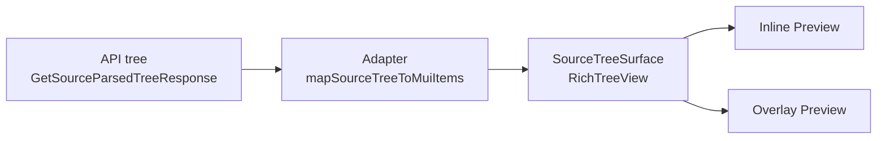

# Source Panel 树形展示现代化设计

## 原始需求

`source panel` 中当前树形结构展示偏“文件夹浏览器”风格，不够现代。需要调研更现代美观的呈现方式，可使用三方库。

## 范围与目标

- **范围**：`sources` 预览中的树展示（内联预览 + 全屏 Overlay）。
- **目标**：
  - 视觉从“文件管理器感”升级到“简洁专业（Notion/Linear 风）”。
  - 保持只读使用场景（展开/收起 + 查看内容）。
  - 与现有 MUI 技术栈一致，降低引入成本。
- **已确认约束**：
  - 仅接受 MIT/开源免费方案。
  - 当前只需要只读展示，不要求拖拽、重命名等复杂交互。

## 现状分析

当前实现采用手写递归树渲染（`Collapse + IconButton + dashed border`），在内联与 Overlay 有两套相似实现，主要问题：

1. 视觉语义偏“文件系统”：`folder/file` 图标 + 虚线层级线强化了“目录树”心智。
2. 信息密度不平衡：层级标签（`L0/L1`）占位感强，内容标签视觉层次不够现代。
3. 维护重复：树节点渲染逻辑在两个组件重复，后续视觉演进易分叉。

## 方案调研与结论

### 方案 A：`@mui/x-tree-view`（MIT）+ 自定义 TreeItem（推荐）

- **优点**：
  - 与现有 MUI 体系最一致，接入成本最低。
  - 有内建的展开、键盘导航和可访问性基础。
  - 可通过自定义 item 渲染做到现代视觉而不引入商业授权。
- **代价**：
  - 社区版不含虚拟化（当前只读中小数据场景可接受）。

### 方案 B：`react-arborist`（MIT）

- **优点**：
  - 虚拟化和高级交互能力强，适合大规模树。
- **代价**：
  - 依赖更重、心智模型与现有 MUI 组件体系割裂。
  - 对当前“只读 + 视觉升级”目标存在超配。

### 方案 C：`@headless-tree/core` + `@headless-tree/react`（MIT）

- **优点**：
  - 定制自由度最高，未来复杂交互扩展空间大。
- **代价**：
  - 接入复杂度最高，前期开发成本显著高于 A。

### 决策

采用 **方案 A**：先用 `@mui/x-tree-view` 社区版完成现代化展示和架构统一；未来若节点规模显著增大，再评估切换到 `react-arborist`。

## 目标架构设计

### 组件职责

- `SourceTreeSurface`（新）
  - 统一承载树渲染、行样式、节点交互（只读）。
  - 接收统一的 tree data 和展示配置（是否显示统计、紧凑模式等）。
- `mapSourceTreeToMuiItems`（新）
  - 将 `SourceParsedTreeNode` 转换为 TreeView item 数据结构。
  - 保持节点 id 稳定，避免展开态抖动。
- `SourceParsedTreeView` / `SourceParsedTreeOverlay`
  - 由“各自渲染树”改为“调用同一个 `SourceTreeSurface`”。
  - 仅保留各自容器差异（标题栏、边距、布局）。

## 视觉与交互规范

### 视觉风格（简洁专业）

- 行高：`32-36px`，避免当前过密层级压缩感。
- 圆角：`8-10px`，配合极浅边框，形成轻卡片行。
- 缩进：改为更平衡的缩进间距，弱化“目录树枝”视觉。
- 图标：从“文件夹/文件”切换为“层级语义图标”（根/分支/叶）。
- 层级标识：`L0/L1` 改为可选轻量徽标，默认弱化。

### 状态设计

- `hover`：浅底色反馈，不位移、不缩放。
- `focus`：明确 focus ring，保证键盘可达。
- `selected/active`：品牌色弱强调，不使用高饱和实底。

### 交互边界

- 本阶段仅保留：
  - 展开/收起
  - tooltip 查看完整文本
  - 键盘导航（沿用 TreeView 能力）
- 明确不做：拖拽排序、重命名、复杂编辑操作。

## 实施步骤

1. 新增依赖：`@mui/x-tree-view`。
2. 新增适配层：`mapSourceTreeToMuiItems`。
3. 新建 `SourceTreeSurface`，接入 `RichTreeView` + 自定义节点样式。
4. 内联预览替换为 `SourceTreeSurface`。
5. Overlay 预览替换为 `SourceTreeSurface`，删除重复树渲染逻辑。
6. 补充/更新单测与交互验证（空态、错误态、展开态、键盘导航）。

## 测试与验收

### 功能验收

- 树可正确展开/收起，节点文本与原数据一致。
- 内联与 Overlay 树展示一致。
- 空树、加载中、错误态行为无回归。

### 体验验收

- 视觉不再呈现强“文件夹浏览器”感。
- 键盘用户可完成节点导航与展开操作。
- Hover/Focus/Active 层次清晰且不过度动画。

## 风险与应对

- **风险**：社区版无虚拟化，极大规模树可能滚动性能下降。
- **应对**：
  - 先完成本次视觉与架构升级。
  - 若后续出现性能瓶颈，再切换 `react-arborist`（MIT）作为二阶段演进。

## 非目标

- 不改后端树接口协议。
- 不引入商业授权组件（如 MUI Pro Tree）。
- 不在本阶段加入拖拽与编辑能力。
