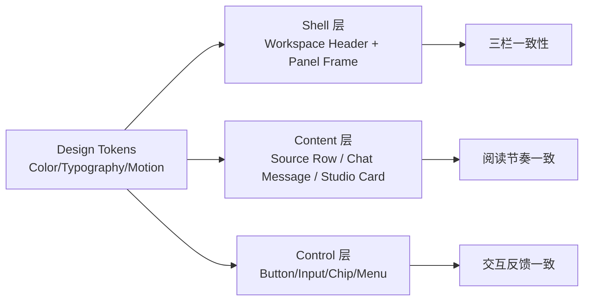

# Web Visual Rebuild Spec (Indigo Porcelain / T2)

## 1) 目标与边界

### 目标
- 在不改布局结构、不改功能逻辑的前提下，重构工作区视觉质感与中等强度动效。
- 提升四个指标：一致性、可读性、动效质量、专业感。
- 覆盖 `all-core` 范围：顶栏 + 三栏（来源 / 对话 / 工作区）+ 全局常用控件。

### 强约束（不可突破）
- **布局不变**：保持三栏信息架构与交互流不变。
- **功能不变**：不增删业务能力，不改变状态机与数据流。
- **允许微调**：仅允许 padding、圆角、控件高度、阴影与色彩层级的视觉微调。

---

## 2) 已锁定设计决策

### 配色（锁定）
- Design Direction: `Indigo Porcelain (靛蓝瓷)`
- 语义色：
  - `bg.base`: `#f1f3f5`
  - `bg.surface`: `#f7f9fb`
  - `bg.subtle`: `#edf1f4`
  - `text.primary`: `#0a1f3d`
  - `text.secondary`: `#152a4a`
  - `border.default`: `#dde4ea`
  - `border.soft`: `#e4e8ec`
  - `accent.primary`: `#152a4a`
  - `accent.onPrimary`: `#f1f3f5`
  - `accent.muted`: `#eaf1f9`

### 字体（锁定）
- 字体方案：`T2`
- `font.heading`: `Noto Sans SC`（500/600）
- `font.body`: `Noto Sans SC`（400/500）
- `font.mono`: `JetBrains Mono`（400/500）
- 设计意图：接近 Notion/生产力工具气质，优先中文可读性与信息密度表现。

### 动效（锁定）
- 动效强度：`B / 中动效`
- 原则：快起快收、低噪声、状态明确，不做大幅位移与炫技转场。

---

## 3) 视觉系统与组件关系

---

## 4) Token 规范（落地级）

### 4.1 Color Token
- 背景层级：
  - L0 页面：`bg.base`
  - L1 面板：`bg.surface`
  - L2 控件/条目：`bg.subtle`
- 文字层级：
  - 主文本：`text.primary`
  - 次文本与说明：`text.secondary`（可配合 0.72~0.82 opacity）
- 边框层级：
  - 默认边框：`border.default`
  - 分隔线：`border.soft`
- 强调层级：
  - 主按钮/关键标签：`accent.primary`
  - 代码块/高亮底：`accent.muted`

### 4.2 Typography Token (T2)
- 标题（H1/H2/H3）：`Noto Sans SC`, weight 600, tracking 0~0.01em
- 面板标题/分区标题：`Noto Sans SC`, weight 500/600
- 正文：`Noto Sans SC`, weight 400, line-height 1.45~1.55
- 辅助信息：`Noto Sans SC`, weight 400/500, size -1 step
- 代码/结构化内容：`JetBrains Mono`, weight 400/500

### 4.3 Radius / Shadow / Stroke
- Radius：`7 / 8 / 10 / 12` 四档，不新增异形圆角。
- Shadow：仅使用轻阴影（用于层级提示），禁止强投影。
- Stroke：1px 为主，颜色来自 `border.default` 或 `border.soft`。

### 4.4 Motion Token（中动效）
- Duration：`120ms`（hover）/ `180ms`（press, focus）/ `240ms`（panel-level）
- Easing：
  - 标准：`cubic-bezier(0.2, 0, 0, 1)`
  - 退出：`cubic-bezier(0.4, 0, 1, 1)`
- Transform：
  - hover: `translateY(-1px)` 或轻微色阶变化
  - active: `translateY(0)` + 对比度回落
- 禁止：大面积弹跳、长距离位移、连续闪烁。

---

## 5) 组件级改造策略（all-core）

### 5.1 顶栏（Workspace Header）
- 统一背景/边框到 Indigo Porcelain token。
- 标题与次级元信息统一为 T2 字体层级。
- 控件（按钮/输入/菜单触发）统一半径与 hover/active 动效节奏。

### 5.2 三栏面板外壳（Sources/Chat/Studio Shell）
- 保留三栏比例与伸缩逻辑，仅更新：
  - panel 背景层级（L1/L2）
  - panel 标题样式
  - 分割线与边框对比度
  - 子页切换动效（240ms）

### 5.3 来源栏（Sources）
- Source row：统一边框、背景、hover 高亮与选中态视觉。
- 菜单、chip、标签：统一 token 与字重（T2）。
- 删除/进入动画：压缩到中动效范围，避免“跳闪”。

### 5.4 对话栏（Chat）
- 消息气泡：用户/AI 通过底色与边框层级区分，不靠饱和色。
- 标题、正文、代码块字体分层：
  - 标题/摘要：Noto Sans SC 600
  - 正文：Noto Sans SC 400
  - 代码：JetBrains Mono
- 输入区与工具按钮使用统一状态反馈曲线。

### 5.5 工作区栏（Studio）
- Tool card 与操作区统一卡片半径、边框、hover 动效。
- 关键 CTA 使用 `accent.primary`，次级操作降级为描边/浅底。
- 结果预览区域提升可读层级（标题、元信息、正文对比）。

### 5.6 通用控件与滚动条
- Scrollbar 维持“弱存在感”，与 Indigo 背景系统一致。
- PanelSubpage 转场统一为 240ms，减少各处不一致 easing。

---

## 6) 变更范围到文件映射（建议）

- Theme/Tokens：
  - `src/app/theme.ts`
- Page Shell：
  - `src/pages/NotebookWorkspacePage.tsx`
  - `src/components/notebook-workspace/layout/WorkspaceHeader.tsx`
- Shared UI：
  - `src/components/notebook-workspace/shared/ui/panelStyles.ts`
  - `src/components/notebook-workspace/shared/ui/PanelSubpageLayout.tsx`
  - `src/components/notebook-workspace/shared/ui/scrollbar.ts`
- Sources：
  - `src/components/notebook-workspace/panel/sources/SourcesPanel.tsx`
  - `src/components/notebook-workspace/panel/sources/components/SourceListRow.tsx`
- Chat：
  - `src/components/notebook-workspace/panel/chat/ChatPanel.tsx`
  - `src/components/notebook-workspace/panel/chat/ChatPanelHeader.tsx`
  - `src/components/notebook-workspace/panel/chat/layoutTokens.ts`
- Studio：
  - `src/components/notebook-workspace/panel/studio/StudioPanel.tsx`
  - `src/components/notebook-workspace/panel/studio/components/StudioToolCard.tsx`

---

## 7) 验收标准（Definition of Done）

- 三栏结构、功能行为、信息架构均与当前版本一致。
- 全域字体已锁定为 T2（标题/正文/代码层级明确）。
- 页面主色与层级全部切换到 Indigo Porcelain token 体系。
- 交互动效时长/easing 与规范一致，无明显风格漂移。
- 关键场景可读性提升（长文本、代码、列表密集场景）。

---

## 8) 风险与缓解

- 风险：字体替换导致局部换行变化。
  - 缓解：按 panel 逐步替换并做最小 padding/line-height 微调。
- 风险：旧样式散落导致 token 漏网。
  - 缓解：优先收敛到 shared token，再清理局部硬编码颜色。
- 风险：动效不一致。
  - 缓解：统一 duration/easing 常量，逐组件校验。

---

## 9) 不做事项（明确排除）

- 不改三栏布局结构和比例策略。
- 不改业务流程、接口、状态机与功能入口。
- 不新增复杂动画框架或重型视觉特效。
