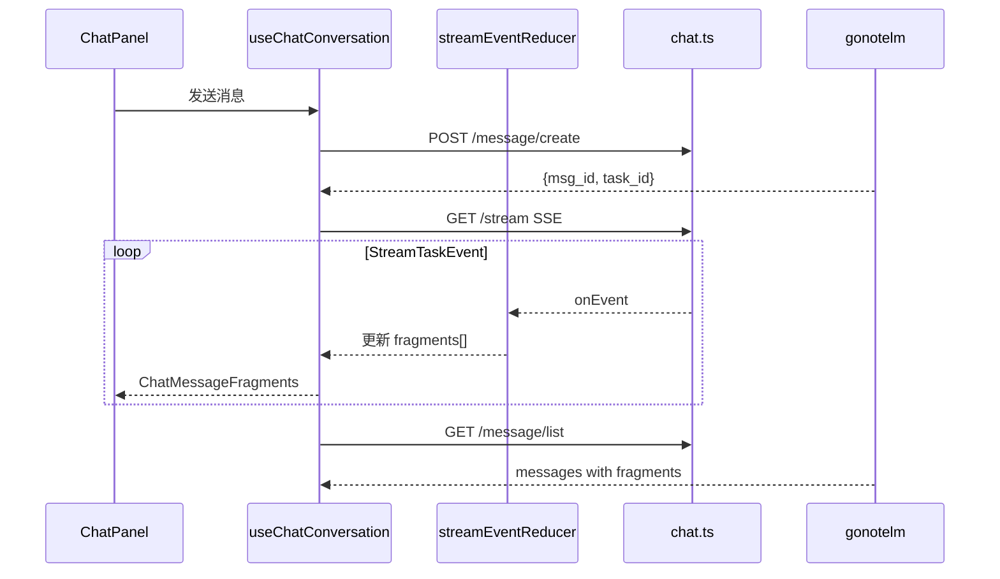

# gonotelm-web Chat API v2 对齐设计

## 背景

gonotelm 服务端已完成 Chat 模块 DDD 重构（关键提交 `166678b`、`22e932f`），消息模型从扁平 `content + citation` 迁移到 **fragment-based message v2**，流式协议从 `phase` 事件迁移到 **StreamTaskEvent patch 模型**。

gonotelm-web 仍使用旧 API 类型与流处理逻辑，需对齐服务端。

### 范围

| 模块 | 处理 |
|------|------|
| Chat message / stream | **全量重构** |
| Notebook / Source | 跳过（外部接口基本不变） |
| Studio | 跳过 |

## 服务端变更摘要

### 历史消息 `GET /api/v1/chat/:id/message/list`

**旧响应：**
```json
{
  "id": "...",
  "chat_id": "...",
  "role": "assistant",
  "content": { "created_at": 0, "kind": "text", "text": { "content": "..." } },
  "citation": [{ "source_id": "...", "doc_ids": ["..."] }]
}
```

**新响应：**
```json
{
  "id": "...",
  "create_time": 0,
  "update_time": 0,
  "chat_id": "...",
  "user_id": "...",
  "role": "assistant",
  "fragments": [
    { "id": 1, "type": "PHASE", "phase": { "status": "FINISHED", "summary": "...", "thought": "..." } },
    { "id": 2, "type": "THINK", "think": { "status": "FINISHED", "content": { "content": "..." } } },
    { "id": 3, "type": "RESPONSE", "response": { "status": "FINISHED", "content": { "type": "text", "text": { "content": "..." } } } }
  ],
  "seq_no": 1,
  "citations": ["doc-id-1", "doc-id-2"]
}
```

Fragment 类型：`REQUEST`（用户）、`THINK`、`PHASE`、`RESPONSE`（助手）。

### 流式 `GET /api/v1/chat/:id/stream`

**旧 SSE payload：**
```json
{
  "id": 1,
  "phase": { "type": "retrieving|thinking|answer", "status": "typing|finished", "content": "...", "citation": [...] },
  "finished": true,
  "finish_reason": "stop",
  "stream_id": "..."
}
```

**新 SSE payload（`StreamTaskEvent`）：**
```json
{
  "id": "1740000000000-0",
  "task_id": "...",
  "create_time": 0,
  "action": "INIT|APPEND|SET|NEW",
  "path": "message|message.citations|message.fragments.think|...",
  "index": -1,
  "message": { ... },
  "citations": ["doc-id-1"],
  "think": { "content": "..." },
  "response": { "content": { "type": "text", "text": { "content": "..." } } },
  "phase": { "phase": { "summary": "...", "thought": "..." } },
  "error": { "message": "..." }
}
```

- 心跳：独立 SSE event type `heartbeat`，payload `{ "heartbeat": "ping" }`
- 断线重连：`last_stream_id` 使用 `event.id`（字符串 Redis Stream ID）
- 任务结束：task status 非 `running` 时 stream 连接正常关闭（`22e932f`）

### 创建消息 `POST /api/v1/chat/:id/message/create`

- 移除 `enhanced_retrieval` 字段（agent 自主探索来源）
- 其余字段不变：`prompt`, `source_ids`, `enable_thinking`, `style`, `answer_length`

### 引用模型

- `citations: string[]` 为有序 `source_doc_id` 列表
- 正文使用 `<sup>idx</sup>`（1-based，对应 `citations[idx-1]`）
- 旧 `<sup>sourceIndex:docIndex</sup>` 格式废弃

## 用户决策

1. **流式 UI**：完整分段展示 PHASE + THINK + RESPONSE（类似 ChatGPT 思考过程）
2. **enhanced_retrieval**：移除前端开关与相关状态
3. **引用格式**：适配 `<sup>idx</sup>` → `citations[idx-1]`

## 方案选择

采用 **方案 B：独立 Reducer + Fragment 渲染器**。

```
streamEventReducer.ts   — 纯函数，应用 StreamTaskEvent patch
messageMapper.ts        — 历史消息 fragments → ChatUiMessage
ChatMessageFragments.tsx — PHASE / THINK / RESPONSE 分段渲染
```

排除方案 A（hook 内联，难维护）和方案 C（压平 text，无法实现分段展示）。

## 架构



## 实现细节

### 1. 类型层 `src/types/api.ts`

新增：
- `ChatMessage`, `MessageFragment`, `FragmentType`, `FragmentStatus`
- `StreamTaskEvent`, `EventAction`, `EventTargetPath`
- `FragmentThink`, `FragmentPhase`, `FragmentResponse`, `FragmentContentUnion`

移除：
- `ChatMessageContent`, `ChatMessageCitation`, `ChatMessageListItem`
- `ChatMessageStreamEvent`, `ChatMessageStreamPhase`, 相关 stream 类型
- `ChatCreateMessageRequest.enhanced_retrieval`

### 2. 流事件 Reducer `streamEventReducer.ts`

输入：当前 `ChatUiMessage` + `StreamTaskEvent`
输出：更新后的 `ChatUiMessage`

| path + action | 行为 |
|---------------|------|
| `message` + INIT | 初始化 assistant 消息 |
| `message.fragments.think` + NEW | 新增 THINK fragment |
| `message.fragments.think.content` + APPEND | 追加思考文本 |
| `message.fragments.think.status` + SET | 更新思考状态 |
| `message.fragments.phase` + NEW | 新增 PHASE fragment |
| `message.fragments.response` + NEW | 新增 RESPONSE fragment |
| `message.fragments.response.content.text` + APPEND | 追加回答文本 |
| `message.fragments.response.status` + SET | 更新回答状态 |
| `message.citations` + SET | 设置 citations 数组 |
| `error` | 记录错误，触发流终止 |

`index` 支持负数索引（`-1` = 最后一个 fragment）。

### 3. UI 模型 `src/components/.../chat/types.ts`

```typescript
interface ChatUiFragment {
  id: number
  type: 'REQUEST' | 'THINK' | 'PHASE' | 'RESPONSE'
  think?: { status: FragmentStatus; content: string }
  phase?: { summary: string; thought: string }
  response?: { status: FragmentStatus; content: string }
  request?: { content: string }
}

interface ChatUiMessage {
  id: string
  role: 'user' | 'assistant'
  fragments: ChatUiFragment[]
  citations: string[]
}
```

移除 `text` 字段。复制功能从 RESPONSE fragment 提取。

### 4. Fragment 渲染 `ChatMessageFragments.tsx`

- **用户消息**：渲染 REQUEST fragment 文本（保留现有气泡样式）
- **助手消息**：
  - **PHASE**：阶段卡片（summary 主文案，thought 副文案）
  - **THINK**：可折叠思考块，RUNNING 时显示动画
  - **RESPONSE**：Markdown 渲染，含 `<sup>idx</sup>` 引用

流式过程中最新 PHASE 的 summary 同步到状态栏（替代旧 retrieving/thinking 文案）。

### 5. 引用解析

**Markdown 变换**（`MarkdownRenderer.tsx`）：
- 正则：`<sup>(\d+)</sup>` → 可点击链接 `#cite-{idx}`
- 移除旧 `sourceIndex:docIndex` 格式

**点击处理**（`ChatMessageItem.tsx`）：
1. `idx` → `citations[idx - 1]` 得 `doc_id`
2. 遍历 notebook 全部 source ids，调用 `GET /source/:id/batch/docs?ids=doc_id` 探测
3. 命中后缓存 `doc_id → source_id` 映射（queryClient）
4. 拉取 `GET /source/:source_id/doc/:doc_id` 展示引用卡片
5. 跳转预览沿用 `onOpenCitationJump`

### 6. 移除 enhanced_retrieval

| 文件 | 变更 |
|------|------|
| `ChatInputBox.tsx` | 删除增强检索 Toggle |
| `ChatPanel.tsx` | 删除相关 props 传递 |
| `useChatConversation.ts` | 删除 state 与请求字段 |
| `api/chat.ts` | 删除 payload 字段 |

### 7. 测试与 Mock

| 文件 | 变更 |
|------|------|
| `fixtures/chat.ts` | fragment 结构 fixture |
| `chatHandlers.ts` | 更新 list/create mock 响应 |
| `streamEventReducer.test.ts` | 新增，覆盖主要 path/action |
| `chatConversationCommon.test.ts` | 更新 citation / mapper 测试 |
| `chat.mock.test.ts` | 移除 enhanced_retrieval 相关 |

## 不在范围内

- Studio 模块全部文件
- Notebook / Source API 客户端（`created_at` 类型可选补充）
- 后端新增 doc_id 直查接口
- Fragment 内容的国际化

## 风险

| 风险 | 缓解 |
|------|------|
| 引用点击需探测 source_id（API 要求 path 含 source_id） | 遍历 notebook sources + batch-get + 缓存 |
| 流事件顺序依赖 index | reducer 单测覆盖负数索引 |
| 历史分页 + 流式草稿合并逻辑复杂 | 保留 `chatStreamDraftRetention` 框架，适配 fragments |

## 验收标准

1. 发送消息后流式展示 PHASE → THINK → RESPONSE 分段
2. 历史消息列表正确渲染 fragments
3. 引用 `<sup>1</sup>` 可点击并展示 doc 内容
4. 断线重连使用 `event.id` 正常工作
5. enhanced_retrieval 开关已移除
6. 现有 chat 相关单测通过
