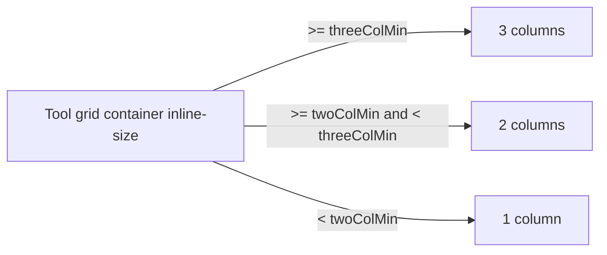

# Studio Tool Grid Responsive Columns

## Goal

Stop fixing Studio tool cards at 3 columns. Column count should follow the **Studio panel content width** so titles stay on one line when the panel is resized narrower.

## Locked decisions

| Item | Choice |
|---|---|
| Trigger | Panel / grid **container** width (not viewport `md`) |
| Mechanism | CSS **container queries** (`container-type: inline-size` + `@container`) |
| Column ladder | 3 → 2 → 1 as width shrinks |
| Card title | `noWrap` + ellipsis fallback at extreme narrow widths |
| Scope | Studio tool catalog grid only |

## Behavior

- Default / wide Studio panel: **3** columns (current look).
- Compressed: **2** columns.
- Very narrow (near panel min ~220px including padding): **1** column allowed.
- Breakpoint pixel values live as named constants next to the grid (or a tiny `studioToolGridLayout.ts`); tune against longest tool titles during implementation.
- Dragging the Studio resize handle must update columns without a page reload (container queries do this natively).

## Implementation sketch

1. Wrap or mark the tool grid as a containment context (`containerType: 'inline-size'`).
2. Replace `gridTemplateColumns: 'repeat(3, minmax(0, 1fr))'` with container-query rules for `repeat(3|2|1, minmax(0, 1fr))`.
3. In `StudioToolCard`, ensure title typography uses `noWrap` / ellipsis and row `minWidth: 0` so overflow never wraps to two lines.
4. Optional unit test: assert layout token / column constants exist; visual check by dragging Studio width.

## Non-goals

- Changing tool catalog order, count, or card chrome beyond title overflow.
- Four-or-more columns on ultra-wide panels.
- Viewport-based breakpoints for this grid.
- ResizeObserver / React column state (rejected in favor of container queries).

## Verification

- Desktop: widen/narrow Studio via resize handle → columns step 3 ↔ 2 ↔ 1 without title wrapping.
- Mobile Studio tab (full width): typically 3 columns; still acceptable if 2 on very small phones.
- Artifact list below the grid unchanged.
