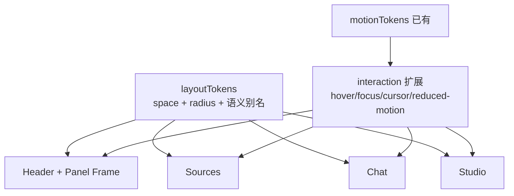
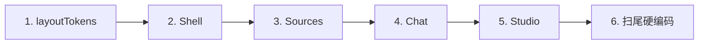

# Workspace Layout Tokens Spec（间距 / 圆角 / 交互统一）

## 1) 目标与边界

### 目标
- 在 **Workspace all-core**（顶栏 + Sources / Chat / Studio）内，统一 spacing、padding、radius 与交互反馈细节。
- 采用 **Token 先行 → 批量收敛**，消除魔法数漂移，提升三栏视觉一致性。
- 配色 / 字体沿用已锁定的 Indigo Porcelain + T2（见 `2026-06-14-web-style-audit-design.md`），本轮不重开设计方向。

### 强约束
- **布局不变**：三栏信息架构与比例策略不变。
- **功能不变**：不增删业务能力，不改状态机 / 数据流 / 接口。
- **范围**：仅 Notebook Workspace；不含 Home。

### 设计依据
- 既有视觉规范：Indigo Porcelain / T2 / 中动效。
- ui-ux-pro-max 原则对齐：
  - 统一 spacing scale，禁止任意像素值
  - **8px base unit**（Swiss）
  - 密集面板参考 Data-Dense：card padding **12px**、gap **8px**
  - AI Chat 参考 AI-Native：message-gap **16px**
  - 触控间隙 ≥ **8px**；微交互 150–300ms 量级

---

## 2) 已锁定决策

### 方案
- **A. Token 先行，再批量收敛**（已选）

### Spacing 刻度（MUI `spacing: 8`，单位为 theme spacing）

| Token | px | MUI | 用途 |
|---|---|---|---|
| `space.xxs` | 4 | 0.5 | 仅图标贴文字 |
| `space.sm` | 8 | 1 | 默认控件 / 列表 gap；触控最小间隙 |
| `space.md` | 12 | 1.5 | 卡片 / 行内 padding；标题 → 正文 |
| `space.lg` | 16 | 2 | 消息间距；面板竖直 padding |
| `space.xl` | 24 | 3 | 面板水平 padding（桌面） |

语义别名：
- `panel.paddingX = space.xl`
- `panel.paddingY = space.lg`
- `panel.titleToBody = space.md`（替代现 `panelTitleToBodySpacing = 1.3`）
- `list.rowGap = space.sm`
- `list.inlineGap = space.sm`（行内控件默认；图标贴字可用 `space.xxs`）
- `chat.messageGap = space.lg`

**明确排除**：6px 半档、14px 等非 4/8 倍数漂移值。

### Radius 刻度

| Token | 值 | 用途 |
|---|---|---|
| `radius.sm` | 8px | chip / 小标签 |
| `radius.md` | 10px | Button / IconButton / Input（与现 theme 一致） |
| `radius.lg` | 12px | Paper / 面板卡片 / 预览 overlay |

**明确排除**：`borderRadius: 1.5 | 1.6 | 2` 混写；统一引用 token。

### Interaction

| 项 | 规范 |
|---|---|
| 时长 | 沿用 `120 / 180 / 240ms` + 现有 easing（`motionTokens`） |
| Hover | 色阶 / 边框为主；默认 **不做位移**；禁止 scale 导致布局抖动 |
| Focus | 可见 focus ring（`action.focus`） |
| Active | 对比略降 |
| Cursor | 可点击元素一律 `pointer` |
| Reduced motion | `prefers-reduced-motion` 时仅保留色 / 透明度过渡 |

---

## 3) Token 与组件关系

---

## 4) 落地顺序与文件映射

### Step 1 — Token 层
- 新增：`src/components/notebook-workspace/shared/ui/layoutTokens.ts`
- 扩展：`src/components/notebook-workspace/shared/ui/motionTokens.ts`（interaction / reduced-motion 约定）
- 导出：`src/components/notebook-workspace/shared/ui/index.ts`
- 对齐（必要时）：`src/app/theme.ts`（`shape` / Button / IconButton / Input 圆角已基本为 10/12）

### Step 2 — Shell
- `src/pages/NotebookWorkspacePage.tsx`
- `src/components/notebook-workspace/layout/WorkspaceHeader.tsx`
- `src/components/notebook-workspace/shared/ui/panelStyles.ts`
- `src/components/notebook-workspace/shared/ui/PanelSubpageLayout.tsx`
- `src/components/notebook-workspace/shared/ui/previewActionStyles.ts`

### Step 3 — Sources
- `SourcesPanel.tsx`
- `components/SourceListRow.tsx`
- `SourceInlinePreview.tsx` / `SourcePreviewOverlay.tsx`（外壳 padding / 圆角）

### Step 4 — Chat
- `chat/layoutTokens.ts` → 改为 re-export / 引用 workspace `layoutTokens`（消除双源）
- `ChatPanel.tsx` / `ChatPanelHeader.tsx` / `ChatComposer.tsx` / `ChatInputBox.tsx`
- `ChatMessageItem.tsx` / `ChatMessagesList.tsx`（`messageGap = 16px`）

### Step 5 — Studio
- `StudioPanel.tsx`
- `StudioArtifactListItem.tsx` 及工具卡片外壳
- `StudioArtifactPreviewOverlay.tsx` + Flashcard / Quiz / DataTable 等 viewer **外壳**
- 设置 Dialog：只统一外层 padding / 圆角，不改表单逻辑

### Step 6 — 验收扫尾
- ripgrep 清理漂移魔法数（如 `0.55`、`0.7`、`0.8`、`1.3`、`1.6`、`borderRadius: 1.5|2`）
- 三栏目视：标题区、列表行、hover/focus 节奏一致
- `pnpm test:unit` 通过

---

## 5) 验收标准（Definition of Done）

1. Workspace 的 spacing / radius / 关键交互节奏单源来自 `layoutTokens` + `motionTokens`；Chat 无第二套 spacing 源。
2. 面板 / 列表 / 消息只用 `4 / 8 / 12 / 16 / 24`；圆角只用 `8 / 10 / 12`；无上述漂移魔法数（极少数非视觉特例须注释原因）。
3. Header + 三栏的标题区、panel padding、行内 gap、hover/focus 观感一致。
4. 可点击有 `pointer`；hover 以色 / 边框为主；focus 可见；尊重 `prefers-reduced-motion`。
5. 布局比例、业务流、接口、状态机与现网一致。
6. `pnpm test:unit` 通过。

---

## 6) 风险与缓解

| 风险 | 缓解 |
|---|---|
| 改 padding 引起局部换行 / 裁切 | 按 Shell → 各栏逐步替换，改完扫列表与预览 |
| 旧魔法数漏网 | Step 6 ripgrep 扫尾 |
| Dialog / Viewer 细节过多拖慢 | 本轮只统一外壳 padding / 圆角，不深改内部排版 |

---

## 7) 不做事项（明确排除）

- 不改 Home、不换配色 / 字体方案
- 不改三栏比例与业务能力
- 不做营销向大留白（32px+ 卡片内边距作为 Workspace 默认）
- 不引入新动画库 / 不大幅改组件 API

---

## 8) 与既有 Spec 的关系

- 本文件是 `2026-06-14-web-style-audit-design.md` 在 **布局密度与交互细节** 上的增量规格。
- 颜色 / 字体 / 动效时长基线仍以 2026-06-14 文档为准；冲突时以「本轮锁定的 spacing / radius / interaction」为准（本轮明确去掉位移 hover 作为默认）。
