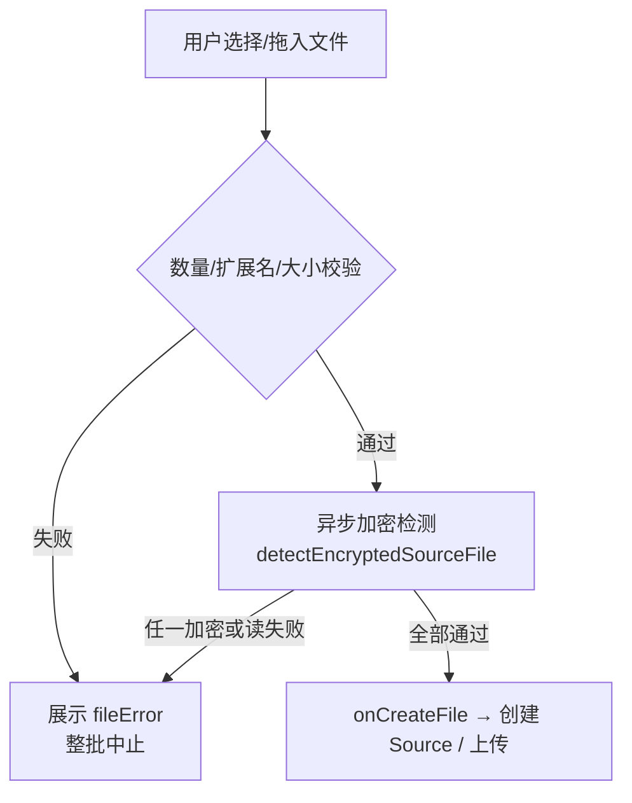

# Encrypted Source File Guard (Frontend)

日期：2026-07-28  
状态：设计已口头批准，待用户审阅本文后进入 implementation plan

## 背景

添加来源时，用户可能选择密码保护的 PDF / DOCX / XLSX 等文件。后端解析链路无法处理加密内容；若先上传再失败，体验差且浪费流量。需要在 **gonotelm-web 前端**于上传前拦截。

## 目标

- 选文件 / 拖入后、创建 Source 与对象存储上传之前，检测加密文件。
- 判定为加密则**不上传**，在添加来源对话框内报错。
- 批量选择时：任一加密 → **整批中止**（与现有扩展名/大小校验一致）。
- 文本类（txt / md / markdown / csv）不做加密检测。

## 非目标

- 后端二次校验 / 解析层加密检测。
- 提示用户输入密码并解密。
- 引入 pdf.js、JSZip 等重量依赖。
- 保证覆盖所有非标准加密变体（允许少量漏报；优先避免误杀）。

## 决策摘要

| 项 | 选择 |
|---|---|
| 范围 | 仅前端 |
| 检测对象 | 可上传二进制：pdf / docx / xlsx / epub；文本跳过 |
| 批量策略 | 方案 A：任一加密整批拦截 |
| 实现方式 | 轻量魔数 / 结构探测，零新依赖 |
| 接入点 | `AddSourceDialogHomeView.handleFilesSelected` |
| 核心模块 | `src/lib/detectEncryptedSourceFile.ts` |
| 错误文案 | `{文件名}: 文件已加密，无法处理` |
| 顺带修复 | `allowedFileExtensions` 与文案补上 `.xlsx` |

## 架构与数据流



- UI / `NotebookWorkspacePage` 上传逻辑不感知检测细节。
- 不修改上传 API 与后端 preparation。

## 检测 API

```ts
type EncryptedCheckResult =
  | { encrypted: false }
  | { encrypted: true; reason: string }

async function detectEncryptedSourceFile(file: File): Promise<EncryptedCheckResult>
```

`reason` 供内部/测试使用；对用户统一展示「文件已加密，无法处理」。读文件失败时对用户展示「无法读取文件内容」。

## 检测规则

偏保守：宁可漏报，少误杀。

| 扩展名 | 行为 | 判定为加密的条件 |
|--------|------|------------------|
| `.txt` `.md` `.markdown` `.csv` | 跳过 | — |
| `.pdf` | 读文件头 + 尾（各约 64KB；小文件整读） | 字节的 Latin1/ASCII 视图中出现 `/Encrypt` |
| `.docx` `.xlsx` | 读文件头；必要时轻量扫描 ZIP 本地头/目录名 | ① 魔数为 OLE `D0 CF 11 E0 A1 B1 1A E1`；② 魔数为 `PK` 且入口名含 `EncryptionInfo` |
| `.epub` | 读头 + 轻量 ZIP 入口扫描 | 非 `PK` 开头；或存在可明确判定的 DRM/`META-INF/encryption.xml` 受限情形——**无把握则放行** |
| 其他已允许扩展名 | 默认不拦 | — |

说明：合法未加密的 docx/xlsx/epub 以 `PK`（ZIP）开头；同扩展名却呈 OLE 复合文档头时，按业界惯例几乎均为 Office 密码包装包。

## 组件改动

### `AddSourceDialogHomeView`

1. 同步校验（数量 / 扩展名 / 大小）保持现有逻辑。
2. `handleFilesSelected` 改为 async：同步通过后对每个文件 `await detectEncryptedSourceFile`。
3. 任一加密或读失败：`setFileError(\`${file.name}: …\`)`，不调用 `onCreateFile`。
4. 检测期间用本地 `checking`（或复用 disabled）防止连点。
5. 支持文案与 `allowedFileExtensions` 补上 xlsx。

### 不动

- `NotebookWorkspacePage.handleCreateFileSource`
- `uploadFileSource` / `uploadToObjectStorage`
- 后端 source / parser

## 测试

`src/lib/detectEncryptedSourceFile.test.ts`（vitest，`File`/`Blob` 构造）：

- 明文 PDF（无 `/Encrypt`）→ 通过
- 含 `/Encrypt` 的 PDF → 加密
- `PK` 头假 docx/xlsx → 通过
- OLE 头假 docx/xlsx → 加密
- txt/md/csv → 跳过且通过

不强制 UI 组件测试；逻辑单测覆盖主路径即可。

## 验收标准

1. 选择加密 PDF/DOCX/XLSX → 不发起创建 Source / 上传，对话框报错。
2. 批量中混入一个加密文件 → 全部不上传。
3. 正常未加密文件上传行为不变。
4. 扩展名列表与 accept/文案包含 xlsx。

## 风险

| 风险 | 缓解 |
|------|------|
| 非标准加密漏检 | 接受；后续若需要可加后端兜底（本文非目标） |
| 大文件读头尾仍耗时 | 仅读最多约 128KB；必要时再加 checking 态 |
| EPUB DRM 形态多样 | 无把握放行，避免误杀合法 EPUB |
