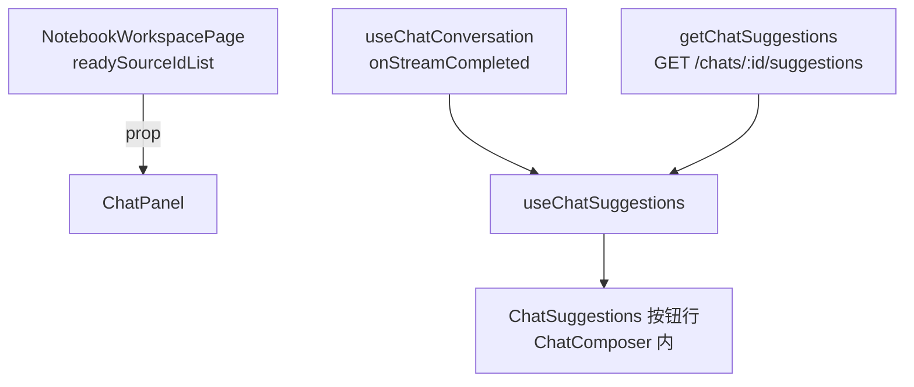

# Chat Suggestions (Frontend)

日期：2026-08-01  
状态：设计已口头批准，待用户审阅本文后进入 implementation plan

## 背景

后端已支持聊天建议生成接口：`GET /api/v1/chats/:chatId/suggestions?source_ids=...`，返回 `{ type: "opener" | "follow_up", questions: string[] }`。类型由后端根据会话状态决定：无聊天消息 → opener（开场建议），有消息 → follow_up（追问建议）；结果按 chat 缓存 6 小时。

本次在 **gonotelm-web 前端**适配该接口：在输入框下方以圆角按钮形式展示建议（最多 3 条、撑满宽度、长文本省略 + hover 全文），点击直接发送。

## 目标

- 展示位置：`ChatComposer` 内、输入框 `ChatInputBox` 下方（当前代码无 `MultipaperRoot` 结构，按现有扁平结构放置）。
- 两种拉取时机：
  - **opener**：笔记本首个来源变 `ready` 后拉取（仅首次，后续来源上传不再触发）。
  - **followup**：每次回答**正常完成**（非中止）后拉取。
- 点击建议 → 直接作为问题发送。
- 建议**始终显示**当前拉取结果，直到下次拉取替换；无建议时整行隐藏。

## 非目标

- 后端建议生成 / 缓存逻辑的任何改动。
- 建议的持久化（会话内状态即可，随 ChatPanel remount 重置）。
- 拉取失败的错误提示（静默处理）。

## 决策摘要

| 项 | 选择 |
|---|---|
| 范围 | 仅前端 gonotelm-web |
| API 层 | `src/api/chat.ts` 新增 `getChatSuggestions` |
| 状态层 | 新增 `useChatSuggestions` hook（独立于 `useChatConversation`） |
| opener 触发 | watch `readySourceIds` 首次 `空→非空` 跃迁，ref 保证仅一次 |
| followup 触发 | `useChatConversation` 新增 `onStreamCompleted` 回调，`finished && !abort` 时触发 |
| 直发 | `handleSendMessage` 增加可选 `prompt` 参数，导出 `sendPrompt` |
| 展示 | `ChatComposer` 新增 `suggestions` + `onSuggestionSelect`，行内最多 3 个圆角按钮 |
| 点击行为 | 直接发送（流式中按钮禁用） |
| 错误处理 | 拉取失败 → 静默，保留已有建议；返回空列表 → 置空隐藏整行 |

## 架构与数据流



- opener：`readySourceIds` 首次空→非空跃迁 → `getChatSuggestions({ id, source_ids: readyIds })`。
- followup：回答正常完成 → `getChatSuggestions({ id, source_ids: selectedSourceIds })`。
- 两种触发共用同一接口；后端自行判定返回类型。
- `source_ids` 为空时前端不发起请求（后端亦返回空结果）。

## API 层

`src/types/api.ts`：

```ts
export interface ChatGetSuggestionsResponse {
  type: string
  questions: string[]
}
```

`src/api/chat.ts`：

```ts
export function getChatSuggestions(params: { id: string; source_ids?: string[] }) {
  // GET /api/v1/chats/:id/suggestions?source_ids=...
  return request<ChatGetSuggestionsResponse>(...)
}
```

## useChatSuggestions hook

输入：`chatId`、`readySourceIds`、`selectedSourceIds`、`onStreamCompleted`（由 `useChatConversation` 触发）。

输出：`suggestions: string[]`、`onSuggestionSelect(question)`。

行为：

- opener 触发：`useEffect` watch `readySourceIds`，`ref` 记录已触发；首次 `空→非空` 时拉取，成功则保存，失败静默保留当前状态、不重试。
- followup 触发：`onStreamCompleted` 回调（经 `useCallback` 稳定）内以 `selectedSourceIds` 拉取并替换；失败静默保留旧建议。
- 过滤：`questions.slice(0, 3)`；成功返回空列表 → 置空（隐藏整行）。
- `chatId` 为空 → 不拉取；unmount 后异步回调不更新状态。

## useChatConversation 改动

- 参数新增 `onStreamCompleted?: () => void`。
- `runStreamSession` 收尾处（`refreshHistoryAfterStream` 之后）：若 `finished && !abortRequestedRef.current` 且 token 未失效，调用 `onStreamCompleted`。
- `handleSendMessage` 增加可选参数 `prompt`：`prompt ?? composerValue`；导出 `sendPrompt = (prompt) => handleSendMessage(prompt)`。

## ChatComposer / ChatSuggestions 展示

`ChatComposer` 新增 props：

```ts
suggestions?: string[]
onSuggestionSelect?: (question: string) => void
disabled?: boolean  // 流式期间禁用点击
```

- `ChatInputBox` 下方新增按钮行（`Box` flex，`gap` 取 `workspaceSpace`，上边距对齐输入框间距）。
- 每个建议一个圆角按钮（`borderRadius: workspaceRadius.md`，outlined 风格）；`flex: 1 1 0` 均分撑满整行宽度（不足 3 条同样撑满）。
- 文本 `whiteSpace: nowrap` + `overflow: hidden` + `textOverflow: ellipsis`；外层 MUI `Tooltip` 展示全文。
- 最多渲染 3 条；流式（`disabled`）时按钮 `disabled`，仍可见。
- 无建议 → 不渲染整行。

## 组件接线

- `NotebookWorkspacePage`：`<ChatPanel ... readySourceIds={readySourceIdList} />`（复用已计算的 `readySourceIdList`）。
- `ChatPanelContent`：
  - `useChatSuggestions` 获取 `suggestions`、`fetchFollowup`。
  - `useChatConversation({ ..., onStreamCompleted: fetchFollowup })`。
  - `onSuggestionSelect` → `sendPrompt(question)`。
  - `ChatComposer` 传入 `suggestions` / `onSuggestionSelect` / `disabled={isStreaming}`。

## 测试

- msw：`chatHandlers.ts` 新增 `GET /api/v1/chats/:chatId/suggestions`（基于 scenario 返回 opener/follow_up 或空）。
- fixtures：`chat.ts` 新增 `createChatGetSuggestionsResponseFixture`。
- `api/chat` 函数测试：URL 与参数序列化。
- `useChatSuggestions` hook 测试（`@testing-library` 或轻量 renderHook 等价物，按仓库现有惯例）：
  - opener：ready 首跃迁触发一次；重复添加不再触发；`chatId` 空不触发。
  - followup：`onStreamCompleted` 触发拉取并替换。
  - 空返回 → 置空。
- `ChatComposer` 布局测试：最多 3 条、撑满宽度、省略号、点击回调。
- 更新 `ChatPanel.layout.test.tsx` 的 mock 以适配新 prop（如需要）。

## 验收标准

1. 新建笔记本上传首个来源 → 输入框下方出现 opener 建议（圆角按钮、撑满宽度、最多 3 条）。
2. 继续上传新来源 → 不再重新拉取 opener。
3. 点击建议 → 直接发送该问题。
4. 回答正常完成后 → 建议替换为 followup。
5. 回答中止 → 不拉取 followup，旧建议保持。
6. 长文本建议 → 按钮内省略号 + hover 显示全文。
7. 无建议 / 返回空列表 → 建议行不显示；拉取失败 → 无错误提示，保留已有建议。

## 风险

| 风险 | 缓解 |
|------|------|
| 后端缓存 6h 导致 followup 始终返回同一批 | 后端行为，本设计不处理；前端始终按时机拉取与替换 |
| `onStreamCompleted` 与 unmount 竞态 | token / ref 守卫，异步回调不更新已卸载状态 |
| 建议按钮撑满过宽（长英文无空格） | ellipsis + Tooltip 兜底 |
