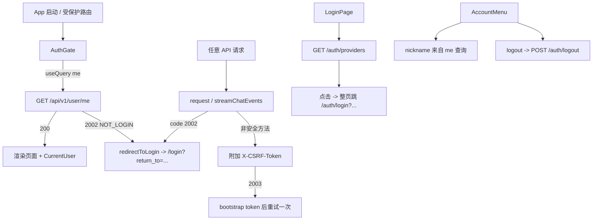

# Web 第三方登录集成（Frontend）

日期：2026-10-01  
状态：设计已口头批准，待用户审阅本文后进入 implementation plan  
范围：gonotelm-web 前端为主；含两项后端前置改动

## 背景

后端已具备第三方登录（当前仅 GitHub）与用户会话能力，接口位于
`gonotelm/internal/interfaces/api/notelm`：

- `GET  /api/v1/auth/providers` → `{ providers: [{ name }] }`（公开）
- `GET  /api/v1/auth/login?login_provider&login_from&return_to` → 302 到 IdP（公开）
- `GET  /api/v1/auth/callback/github` → 302 回 `return_to`（公开）
- `POST /api/v1/auth/logout` → 204（公开）
- `GET  /api/v1/user/me` → `{ user_id, nickname }`（受保护）

关键后端行为（本设计据此适配）：

1. **CSRF 双提交**：整个 `/api/v1` 挂了 `csrfMiddleware`（`server.go:231`，
   `pkg/http/middleware/csrf.go`）。安全方法（GET/HEAD/OPTIONS）无 `gnlm_csrf` cookie 时会下发
   一个 JS 可读 cookie（`httpOnly=false`、`Secure`、`SameSite=Lax`、`Path=/`）；非安全方法
   （POST/PUT/PATCH/DELETE）必须带 `X-CSRF-Token` 且与 cookie 一致，否则
   `403 { code: 2003, msg: "CSRF_TOKEN_INVALID" }`。
2. **login 幂等**：当前会话有效时 `/auth/login` 直接 302 到 `return_to`（或 `/`），不再走 OAuth
   （`loginhandler.go:42`）。
3. **return_to 白名单**：`schema.IsSafeReturnTo`（`schema/auth.go:57`）只允许站内相对路径
   （`/` 开头、非 `//`、非 `/\`、无 `\`/CR/LF、无 scheme/host）。非法值导致
   `AuthLoginRequest.Validate` 返回参数错误（HTTP 200 + `code:1000` JSON）；导航式请求前端无法
   接管，浏览器会直接显示 JSON。
4. **callback 一定重定向**：`auth.go:167` 302 到净化后的 `return_to`（默认 `/`），不再 204。
5. **会话 cookie**：`gnlm_user_sid`（`httpOnly=true`，JS 读不到）、`gnlm_user_id`（JS 可读，
   `httpOnly=false`，仅作展示信号，非授权依据）。
6. 错误码：`2002 NOT_LOGIN`（401）、`2003 CSRF_TOKEN_INVALID`（403）。

现状：前端没有登录页、没有 CSRF 处理、`/debug/login` 是调试页；后端加 CSRF 后前端**所有写操作会 403**。

## 目标

- 应用启动即调用 `GET /api/v1/user/me` 建立会话与用户信息；未登录跳登录页。
- `/login` 登录页：拉取并展示允许的第三方登录方式，点击完成整页 OAuth 跳转。
- 统一处理 `NOT_LOGIN`：任意接口返回 2002 → 跳 `/login?return_to=<当前路径>`。
- 统一 CSRF：所有非安全方法自动附带 `X-CSRF-Token`，2003 时自动重试一次。
- 账号菜单展示 `nickname`，支持登出。
- 删除 `/debug/login` 调试页，替换为符合 Studio 设计风格的正式登录页。

## 非目标

- 账号注册、密码/邮箱登录、找回密码（仅第三方登录）。
- 后端 CSRF / 登录 / 用户信息的业务逻辑改造（仅两项前置见下）。
- 主动的细粒度权限/角色控制（仅“已登录 / 未登录”）。

## 决策摘要

| 项 | 选择 |
|---|---|
| 范围 | 前端 gonotelm-web 为主 |
| 会话检查 | 启动调用 `GET /user/me`（主动），配合任意接口 2002 被动跳转 |
| 启动门 | `AuthGate` 包 `/` 与 `/notebook/:id`；`/login` 不包 |
| 登录态来源 | 后端会话（`/user/me` 成功与否），不依赖可读 cookie 判有效 |
| CSRF | `lib/csrf.ts` 读写 `gnlm_csrf`，非安全方法带 `X-CSRF-Token`；2003 重试一次 |
| return_to | 前端按 `IsSafeReturnTo` 同规则净化后才使用 |
| 登录成功回跳 | 后端 `frontendBaseUrl + return_to`（见前置） |
| 登出 | 账号菜单「退出登录」→ `POST /auth/logout` → 清缓存 → `/login` |
| i18n | 新增 `auth` 命名空间（zh/en） |

## 架构与数据流



## 模块设计

### 1. Auth 基础模块（`src/lib/auth.ts`）

- `NOT_LOGIN_CODE = 2002`、`CSRF_CODE = 2003`
- `isNotLoginError(err): boolean`、`isCsrfError(err): boolean`
- `sanitizeReturnTo(raw: string | null | undefined): string`：与 `IsSafeReturnTo` 完全一致——
  空 → `/`；非 `/` 开头 → `/`；`//` 或 `/\` 开头 → `/`；含 `\`、CR、LF → `/`；否则原样返回。
- `buildLoginPath(returnTo?: string): string` → `/login?return_to=<encodeURIComponent>`
- `redirectToLogin(): void`：模块级 in-flight 去重；当前已在 `/login` 时不跳；
  `return_to` 取 `window.location.pathname + window.location.search` 并净化；
  `window.location.assign(buildLoginPath(returnTo))`。`typeof window === 'undefined'` 时安全返回。

### 2. CSRF 层（`src/lib/csrf.ts`）

- `CSRF_COOKIE_NAME = 'gnlm_csrf'`、`CSRF_HEADER_NAME = 'X-CSRF-Token'`
- `SAFE_METHODS = {GET, HEAD, OPTIONS}`
- `readCsrfToken(): string`：从 `document.cookie` 解析（node 环境返回 `''`）。
- `ensureCsrfToken(): Promise<string>`：读 cookie；为空则发一次安全请求
  `GET /api/v1/auth/providers`（`credentials:'include'`，公开接口）以触发后端下发，再读一次；
  并发调用共享同一个 in-flight promise，避免重复 bootstrap。
- `attachCsrf(headers, method)`：非安全方法时写入 `X-CSRF-Token`。
- `handleCsrfError(err): Promise<boolean>`：命中 `CSRF_CODE` 时重新 `ensureCsrfToken`，返回
  `true` 表示允许重试一次。

### 3. 被动拦截（改 `src/lib/http.ts`、`src/api/chat.ts`）

- `request()`：
  - 发请求前：非安全方法 `await ensureCsrfToken()` 并附 `X-CSRF-Token`。
  - 失败路径：若 `err.code === 2003` 且本次未重试 → 刷新 token 重试一次。
  - 若 `err.code === 2002` → `redirectToLogin()` 后 re-throw。
- `streamChatEvents()`：对 `!response.ok` 与 JSON `body.code` 两处做同样的 2002/2003 处理。
  （SSE 用 GET，安全方法，不需要 CSRF 头。）

### 4. `src/api/auth.ts`（扩展）

- `getAuthProviders(): Promise<AuthProvidersResponse>`
- `logout(): Promise<null>`（`POST /api/v1/auth/logout`；返回 204）
- 保留并复用现有 `buildAuthLoginPath` / `buildAuthLoginUrl` / `goToAuthLogin`（整页跳转）。

### 5. `src/api/user.ts`（新增）

- `getMe(): Promise<MeResponse>` → `GET /api/v1/user/me`
- 共享 hook `useMeQuery()` 放在 `src/components/auth/useMeQuery.ts`：
  `useQuery({ queryKey: ['me'], queryFn: getMe, retry: false })`，供 `AuthGate`、`LoginPage`、
  `AccountMenu` 复用（同一 queryKey 自动去重）。

### 6. AuthGate（`src/components/auth/AuthGate.tsx`）

- 包住受保护路由。用 `useMeQuery()`：
  - `isPending` → 启动占位（居中 `CircularProgress`，不渲染受保护内容）。
  - 成功 → 渲染 `children`。
  - 错误 `2002` → 渲染占位（`request()` 已触发整页跳转）。
  - 其他错误（网络等）→ 错误态 + 重试按钮（`refetch`），避免瞬时故障锁死应用。

### 7. 登录页（`src/pages/LoginPage.tsx`）

- 从 `useSearchParams()` 读 `return_to` → `sanitizeReturnTo`。
- 已登录短路：`useMeQuery()` 成功 → `<Navigate to={returnTo} replace />`。
- providers：`useQuery(['auth','providers'], getAuthProviders)`，四态：
  - loading → 居中 spinner
  - error → 文案 + 重试
  - 空数组 → “暂无可用登录方式”
  - 列表 → 每个 provider 一个按钮
- 点击 provider → `goToAuthLogin({ provider: name, from: 'web', returnTo })`（整页跳转）。
- 视觉（Studio）：居中 hairline 卡片、cream paper 背景、forest 主按钮、Instrument Serif 标题、
  Geist 正文；文案克制、无 emoji。

### 8. 账号菜单 / 登出（`src/components/auth/AccountMenu.tsx`）

- 展示 `useMeQuery().data.nickname`（字段缺失回退 user_id 尾部或通用文案）。
- 菜单项「退出登录」：`logout()` → `queryClient.clear()` → `window.location.assign('/login')`
  （登出用不带 `return_to` 的干净跳转，不等同于 `redirectToLogin`）。
- 放置：`HomePage` 顶部新增 header 行（品牌/标题 + AccountMenu，复用现有预留空 Stack 位置）；
  `WorkspaceHeader` 右侧加入同一组件。

### 9. 路由 / i18n / 清理

- `src/app/router.tsx`：新增 `/login`；`/` 与 `/notebook/:id` 用 `<AuthGate>` 包裹；
  删除 `/debug/login`。
- 删除 `src/pages/LoginDebugPage.tsx`。
- 新增 `src/locales/{zh,en}/auth.json`，在 `src/i18n/index.ts` 注册 `auth` 命名空间。

### 10. 类型（`src/types/api.ts`）

```ts
export interface AuthProvider { name: string }
export interface AuthProvidersResponse { providers: AuthProvider[] }
export interface MeResponse { user_id: string; nickname: string }
```

## 后端前置（保持前端跨源直连所需，共两项）

1. **CORS 允许 `X-CSRF-Token`**：`pkg/http/middleware/cors.go` 的 `corsAllowHeaders` 追加
   `X-CSRF-Token`（并补 `cors_test.go` 断言）。否则跨源带 CSRF 头的预检被拒，所有写操作失败。
2. **callback 回前端源**：新增配置（如 `frontendBaseUrl` / 白名单），callback 重定向改为
   `frontendBaseUrl + sanitizedReturnTo`；为空时保持相对路径（生产同源）。保持 `redirect_uri`
   在后端、前端纯跨源直连，同时让浏览器登录后能回到 SPA。（`IsSafeReturnTo` 继续做路径白名单。）

## 开发期设置

- 用 `http://127.0.0.1:5173` 打开前端（与 API 主机 `127.0.0.1` 一致），Cookie 才是 JS 可读的；
  `localhost` 与 `127.0.0.1` 不同主机，读不到 `gnlm_csrf`。
- `.env.local` 保持 `VITE_API_BASE_URL=http://127.0.0.1:7099`（跨源直连）。
- `[cors] allowOrigins` 已含 `http://127.0.0.1:5173`。
- 配置后端 `frontendBaseUrl=http://127.0.0.1:5173`（前置 2 完成后）。

## 测试（vitest + react-test-renderer + msw，沿用现有风格）

- `src/lib/auth.test.ts`：`sanitizeReturnTo`（含 `//evil`、`/\`、`\`、CRLF、空）、`buildLoginPath`、
  `isNotLoginError`。
- `src/lib/csrf.test.ts`：`readCsrfToken` 解析、`ensureCsrfToken` 幂等共享、`attachCsrf` 方法判定。
- `src/lib/http.test.ts`：非安全方法自动带 `X-CSRF-Token`；2003 刷新后重试一次；2002 触发重定向。
- `src/api/auth.test.ts`（扩展）：providers 解析、logout、login URL 构造。
- `src/api/user.test.ts`：`getMe`。
- `src/components/auth/AuthGate.test.tsx`：loading / 成功 / 2002 / 其他错误重试。
- `src/pages/LoginPage.test.tsx`：四态 + 点击触发跳转。
- `src/components/auth/AccountMenu.test.tsx`：昵称展示、登出调用与清缓存。
- msw：新增 `src/test/mocks/handlers/authHandlers.ts`（`GET /user/me`、`GET /auth/providers`、
  `POST /auth/logout`），在 `handlers/index.ts` 注册；`fixtures` 补响应工厂。

## 验收标准

1. 未登录打开 `/` 或 `/notebook/:id` → `/user/me` 返回 2002 → 跳
   `/login?return_to=<当前路径>`，不闪现受保护内容。
2. 登录页展示后端返回的 providers；点击任一 → 整页跳 `/auth/login` → IdP → 回调 →
   `frontendBaseUrl + return_to`，回到原页面且 `/user/me` 成功。
3. 已登录访问 `/login` → 自动跳 `return_to`。
4. 任意受保护接口返回 2002（如会话过期）→ 跳登录并携带当前路径。
5. 所有非安全请求带 `X-CSRF-Token`；cookie 缺失时自动 bootstrap；2003 自动重试一次后仍失败才上抛。
6. 非法 `return_to`（如 `//evil.com`）被前端净化为 `/`，绝不发给后端。
7. 账号菜单显示 `nickname`，登出后回到登录页且 `/user/me` 不再成功。
8. `/debug/login` 路由与 `LoginDebugPage.tsx` 已移除；正式登录页符合 Studio 风格。

## 风险

| 风险 | 缓解 |
|---|---|
| 跨源 Cookie 可读性依赖主机一致 | 文档要求开发用 `127.0.0.1:5173`；不依赖可读 cookie 判会话有效性（以 `/user/me` 为准） |
| 并发非安全请求在 token 就绪前触发 | `ensureCsrfToken` 共享 in-flight promise |
| 2003 重试放大请求 | 每个请求最多重试一次 |
| `redirectToLogin` 与 AuthGate 双重跳转 | 跳转统一收敛到 `lib/auth.ts`，模块级去重；AuthGate 仅渲染占位 |
| 瞬时网络错误误判未登录 | 仅 `2002` 触发跳转；其他错误显示重试态 |
| 后端前置未完成导致跨源写操作失败 | 明确列为前置依赖，先完成再联调 |
