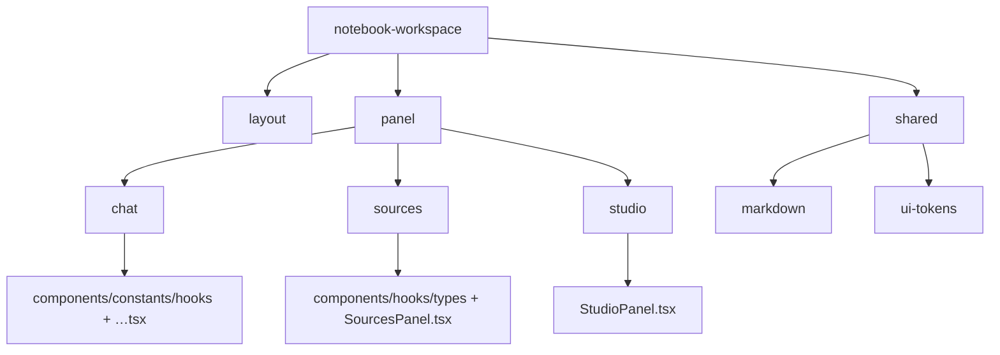

## Context

当前 `notebook-workspace` 下已经存在较多可复用模块，但目录层次以“历史演进”形成：`chat` 会话 UI 曾与 `sources`/`studio`/添加来源对话框等分别在多层级间漂移。结果是：

- 面板内逻辑与跨面板共享逻辑边界需要持续收敛；
- 新增某个 panel 能力时，开发者需要在多个层级间跳转；
- `panels`/`panel`、顶层转发导出等命名需与团队约定一致。

约束：

- 不改变用户可见功能与交互路径；
- 不修改后端 API 协议；
- 不新增第三方依赖；
- 与已有 chat 模块化风格保持一致。

## Goals / Non-Goals

**Goals:**

- 建立“按 panel 分域（**单数** `panel/` 目录）+ 域内分层 + shared + layout”的统一目录规范。
- 让 `sources`、`studio` 与 `chat`（均在 `panel/*`）具备清晰的模块边界。
- 跨 panel Markdown 渲染与标点归一等能力以 `shared/markdown/**` 为唯一实现源头，杜绝顶层中转文件。
- 仅被 notebook workspace 使用的轮询钩子与 workspace 共处，缩小全局 `hooks/` 误用半径。

**Non-Goals:**

- 不新增功能（如新面板、新业务流程）；
- 不重写状态管理方案；
- 不改动 API 参数语义与请求时序；
- 不做 UI 风格重设计。

## Decisions

### 1) 顶层采用“Panel Domain + Shared + Layout”三段式

- 决策：`notebook-workspace` 按 **`panel/*`**、`shared/*`、`layout/*` 组织；业务 panel 文件夹使用**单数** `panel/`，因其表示“面板域集合”的一级挂载点而与各子目录（`chat`/`sources`/…）并列。
- 原因：与本变更单名称及目录语义一致（`panel/` 下同列 `sources`、`studio`、`chat`；聊天实现代码全部位于 **`panel/chat/`**）。
- 备选方案：`panels/` 复数既往约定 — 已收敛为单数以降低与 “多个 Panel 实例” 的口语歧义。



目标目录命名（细化）：

```text
src/components/notebook-workspace/
  hooks/
    useSourcePolling.ts
  layout/
    WorkspaceHeader.tsx
    index.ts
  panel/
    sources/
      components/
        SourceListRow.tsx
        FlowLoadingOverlay.tsx
        AddSourceDialog.tsx
        AddSourceDialogHomeView.tsx
        AddSourceDialogEditorView.tsx
      hooks/
        SourceSelectionController.tsx
      types/
        sourceTypes.ts
      SourcesPanel.tsx
      index.ts
    studio/
      StudioPanel.tsx
      index.ts
    chat/
      components/
      constants/
      hooks/
      …（会话 UI 与 hooks 等 Chat 域代码）
  shared/
    markdown/
      MarkdownRenderer.tsx
      markdownNormalization.ts
      index.ts
    ui/
      panelStyles.ts
      scrollbar.ts
      index.ts
    index.ts
```

命名约束：

- panel 目录使用业务名小写（`sources` / `studio` / `chat`）；聊天子域 Canonical 路径为 **`panel/chat/`**。**不再**保留平行目录名 `chat-panel/`。
- 仅 panel 对外入口使用 `index.ts`；workspace 对上（页面层）主要通过 `notebook-workspace/index.ts` 取用公共 API。
- **`AddSourceDialog*`** 归入 `panel/sources/components/`，语义上与普通 sources UI 组件一致，不单独维护 `add-source-dialog/` 目录。
- 跨模块引用统一使用 `@/` 别名（例如 `@/api/*`、`@/types/*`）；同模块内短距离依赖保留相对路径。

### 2) 去掉多余转发层

- 决策：移除 `notebook-workspace` 根目录下一度用于兼容旧路径的单行 **re-export** 文件（如 `scrollbar.ts`、`StudioPanel.tsx` 等）；引用方改为 `shared`、`panel/...`、`layout` 等目标模块。
- 决策：聊天实现 **直接** 驻留在 **`panel/chat/`**；`panel/chat/ChatPanel.tsx` 与 `shared/markdown/*` 等引用方一律 **direct import** 同域目标模块，不设 `chat-panel` 前缀，也不增设仅用于兼容旧路径的 re-export。
- 原因：与同层其它 panel（`sources`/`studio`）对称，缩短读者心智模型；根除历史目录名分叉。

### 3) Markdown 置于 shared

- 决策：`MarkdownRenderer` 与 `normalizeMarkdownDelimiters` 的实现文件仅存在于 `shared/markdown/`，不再有根目录克隆实现。
- 原因：多处（来源预览、聊天消息、citation UI）共用，符合“跨两处即 shared”的规则。

### 4) useSourcePolling 归属

- 决策：迁至 `notebook-workspace/hooks/useSourcePolling.ts`，`NotebookWorkspacePage` 仅从该路径导入。
- 理由：全仓库仅此页面使用；与 workspace 数据来源/状态耦合，迁入全局 `src/hooks` 易造成“看似通用却只服务一页”的假共享。

### 5) 先机械迁移，再清理与增强（仍适用）

- 决策：仍优先保证路径变更后行为等价，再轻装清理重复导出。
- 回归验证：`pnpm eslint`、`pnpm test`、`pnpm build` 作自动化门禁。

### 6) `FlowLoadingOverlay` 归属到 sources components

- 决策：将 `FlowLoadingOverlay` 下沉到 `panel/sources/components/FlowLoadingOverlay.tsx`。
- 原因：当前仅被 `SourceListRow` 使用，属于 sources 行项 UI 细节，不应占用 workspace 根目录。

## Risks / Trade-offs

- [迁移过程中导入路径断裂] → 分批移动 + index 收口 + CI 门禁。
- [shared 过度抽象] → 仅收纳已多处复用的稳定模块（当前为 markdown UI、scrollbar、panel chrome）。
- [大规模移动噪音] → 按变更单分面板域描述与验收。

## Migration Plan（当前状态）

1. ~~定义目标目录与导出约定~~
2. ~~Sources 域：`panel/sources`，对话框在 `components/`~~
3. ~~Studio 域：`panel/studio`~~
4. ~~Layout/Shared：`layout`、`shared`~~
5. ~~Chat：迁入 `panel/chat/`，移除旧 `chat-panel/` 与前序临时中转路径~~
6. ~~单数 `panel/`、`useSourcePolling` 迁入、`MarkdownRenderer` 实装收敛至 `shared/markdown`~~

## Open Questions

- `SourceSelectionController` 是否未来上移至 workspace 级 controller：`sources panel` 仍是最合理默认。
- `StudioPanel` 未来若承载重型交互是否需要独立 `studio/components` 子树。
- 人工回归清单（冒烟）仍为发布前可选加强项。
