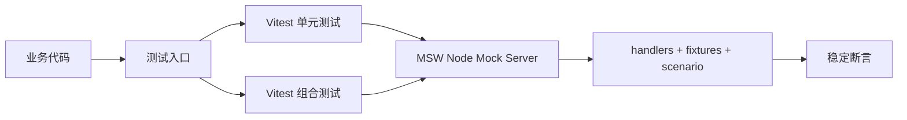

## Context

当前 `web` 项目的测试执行需要真实后端可用，导致：
- 本地开发时单元测试与组件组合测试不可稳定复现。
- 异常分支（超时、5xx、空数据）很难系统化验证。

现有约束：
- 前端使用 TypeScript/React 体系，需要与现有测试框架兼容。
- 方案需可在本地和 CI 同时运行，且不依赖真实后端可用性。
- 需要尽量减少对业务代码侵入，优先通过测试基础设施实现隔离。

## Goals / Non-Goals

**Goals:**
- 在测试环境中默认拦截网络请求，脱离真实后端即可完成主要测试。
- 提供统一的 API mock 组织方式（handlers + fixtures），覆盖成功/失败/边界场景。
- 将测试分层标准化：单元、组合测试职责清晰。

**Non-Goals:**
- 不在本次变更中重写全部历史测试，只迁移核心路径并提供迁移模式。
- 不在本次变更中引入 UI 自动化测试或视觉基线体系。
- 不引入复杂的端到端后端联调替代方案（本次核心是“去后端依赖”）。

## Decisions

1) 统一 API Mock 方案采用 `MSW`
- 决策：测试默认通过 `MSW` 拦截 `fetch/XHR`，未声明的请求直接失败。
- 原因：`MSW` 与 Vitest/Jest/浏览器环境兼容，贴近真实请求层，不需改业务调用方式。
- 备选：
  - `axios-mock-adapter`：仅适配 axios，无法覆盖 fetch 与更广泛调用。
  - 手写 `fetch` mock：灵活但可维护性差，跨测试复用成本高。

2) 测试分层采用“单元 + 组合”双层模型
- 决策：
  - 单元测试：纯函数/Hook 逻辑，禁止真实网络。
  - 组件组合测试：允许多个组件协作，通过 MSW 提供场景数据。
- 原因：在当前阶段优先解决后端依赖问题，以最小成本建立稳定回归。
- 备选：
  - 仅保留单元测试：无法覆盖关键交互链路。
  - 引入 UI 自动化：实现成本更高，且超出当前目标范围。

3) CI 仅执行 mock 驱动测试通道
- 决策：CI 统一执行 `npm run test:ci`（基于 Vitest + MSW）。
- 原因：保证每次提交都在无后端依赖前提下完成稳定校验。
- 备选：保留联调依赖型测试（不稳定，且与变更目标冲突）。

## Risks / Trade-offs

- [Risk] Mock 与真实后端契约漂移 → Mitigation：关键接口增加契约示例与定期联调校验任务。
- [Risk] 初期编写 handler 与 fixture 成本上升 → Mitigation：按业务域提供模板与共享工厂函数。
- [Risk] 未声明请求导致测试大量失败 → Mitigation：分阶段迁移，先在新增测试开启严格模式，再逐步全局收敛。

## Migration Plan

1. 建立测试基础设施：`MSW` 初始化、全局测试 setup、handler 目录规范。  
2. 选取 2-3 条核心用户路径迁移到 mock 驱动测试（登录前后关键工作流、聊天面板核心交互等）。  
3. 配置 CI 执行 mock 驱动测试流程。  
4. 编写开发文档与 checklist，要求新增功能必须提供 mock 测试覆盖。  

回滚策略：
- 若 CI 稳定性异常，可临时降低严格模式范围，并逐步恢复全量拦截。
- 保留原联调测试路径一段过渡期，确保可快速切回排障。

## Open Questions

- 是否需要在后续阶段增加契约测试（OpenAPI/Schema）以进一步降低 mock 漂移风险？
